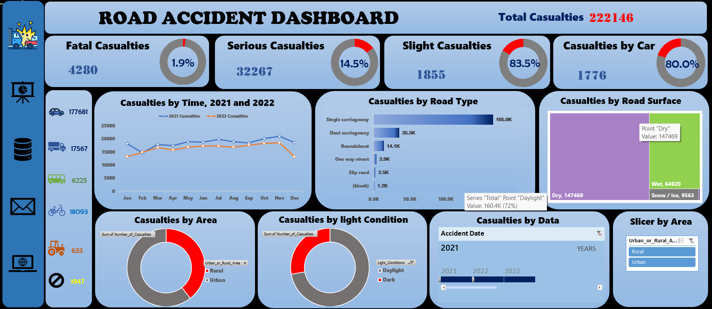
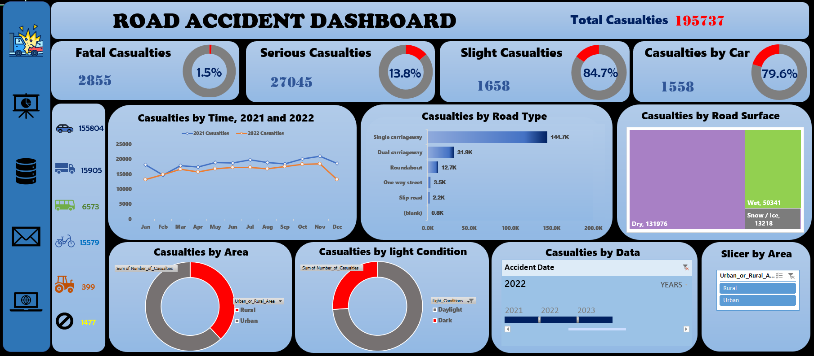

# ROAD ACCIDENT ANALYSIS

Complete Road Accident Analysis in M.S Excel

## Introduction
Road accidents remain a major global public safety issue, often resulting in significant social, economic, and health impacts. 
This project analyzes road accident data to uncover meaningful patterns, identify high-risk factors, and support data-driven decision-making for safer transportation systems.
The data provides insights into accident frequency, severity, types of vehicles involved, road conditions and more, helping to inform traffic safety measures and improvements.

## Project Goal
The goal is to provide actionable insights that could help traffic authorities and policy-makers improve road safety measures.
This analysis focuses on accident severity, the impact of weather conditions, road surface types, and
time-based trends. The final output includes an interactive dashboard allowing users to filter data by year, location, and vehicle type.

## Objectives 🎯
The primary objectives of this analysis are:
**Identify KPI Trends:** Analyze total casualties, total accidents, and fatality rates over time.
**Severity Analysis:** Determine the distribution of accidents by severity (Fatal, Serious, Slight).
**Environmental Impact:** Assess how weather (Rain, Snow, Fog) and road surface conditions affect accident frequency.
**Vehicle & Demographics:** Analyze the involvement of different vehicle types and casualty demographics.
**Vehicle Type Distribution:** Analyzes the types of vehicles involved in accidents.
**Road Surface and Type:** Understands how different road conditions (dry, wet, snow/ice) impact accidents.
**Urban vs. Rural:** Distinguishes accident trends based on whether the accident occurred in an urban or rural area.
**Monthly Trends:** Displays accident data by month to help identify seasonal patterns and spikes in accident numbers.
**Light Conditions:** Examines the impact of daylight and darkness on accident rates.
Build intuitive dashboards and visualizations to communicate insights.

💾📂 Dataset Description
The dataset used in this analysis has The Data has Rows = 307,975 Columns = 25. (Available upon request)

Key Features:
Data Structure
- Accident_Index
- Accident Date
- Junction_Control	
- Junction_Detail	Accident_Severity	
- Latitude/Longitude
- Light_Conditions	- (Daylight, Dark)
- Local_Authority_(District)	
- Road_Surface_Conditions	- (Dry, Wet, Snow/Ice)
- Road_Type	
- Speed_limit	
- Urban_or_Rural_Area	
- Weather_Conditions
- Vehicle_Type - (Cars, Buses, Vans, Bikes, Others)
- Road type: Slip road, round about, Dual carriage

## 🛠️ Methodology 

### 🧹 Data Preparation

Key preprocessing performed:
- Removed duplicates and inconsistent entries
- Standardized date/time formats
- Cleaned and normalized categorical fields
- Handled missing values
- Created computed fields (e.g., accident hour, severity categories)

### 📈 Tools & Techniques Used
- Microsoft Excel (sole analysis tool)
- Pivot Tables & Pivot Charts for analysis
- Power Query for dat cleaning
- Conditional Formatting
- Lookup Functions (VLOOKUP/XLOOKUP)
- Data Cleaning & Transformation
- Functions for derived metrics
- Data Visualization: Created an interactive Dashboard with Slicers and Timeline filters.
- Charts used: Donut Charts (Severity), Bar Charts (Casualties by Location), Line Charts (Trend over time), and Map Charts (Geographical distribution).

## 📊 Analysis & Key Insights

Some of the major insights derived include:
- Peak Accident Times: Higher accident frequency during evening rush hours.
- Road Surface: Dry road surface had the highest road accident and casualties.
- Day-of-Week Trends: Increased incidents on weekends/Fridays.
- Weather Conditions: Most accidents occurred under clear weather, suggesting human factors are dominant.
- Severity Analysis: Specific road types or intersections show higher severe-accident rates.
- Vehicle Type Patterns: Single carriageway followed by Dual carriageway leading.
- Area with urban leading.
- Visualizations created in Excel (pivot charts, bar charts, heat maps, etc.) help support each insight.

### Visualisation

Feature:
The dashboard has four dynamic interative icon or buttoms. which includes;
1. Dashboar Icon/ button📊 - which when clicked lead to the dashboard page
2. Database Icon / button 🔢 - when clicked leads to the database or the data sheet of this analysis.
3. Email Icon 📧 - when clicked opens up email with my email for you to send me messages
4. Website Icon 🕸️ - when clicked on, opens up wikipedia Road Accident website for further reading.

Data Sheet         |     KPI Sheet
:----------------------:|:-------------------------:
        | 

2021 Dashboard       |     2022 Dashboard
:----------------------:|:-------------------------:
        | 

## Recommendations
- Introduce congestion-reduction measures in high-density urban zones.
- Implement smart traffic signals, improved pedestrian crossings, and speed-calming measures.
- Integrate protected lanes for cyclists and powered two-wheelers.
- Launch awareness campaigns addressing:Distracted driving, Speeding, Lane discipline, Urban pedestrian safety.

  Thank You for Reading.
